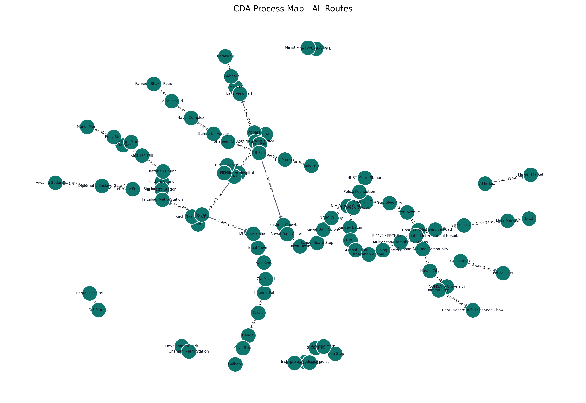
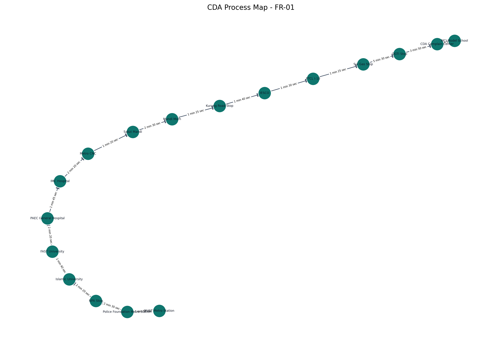
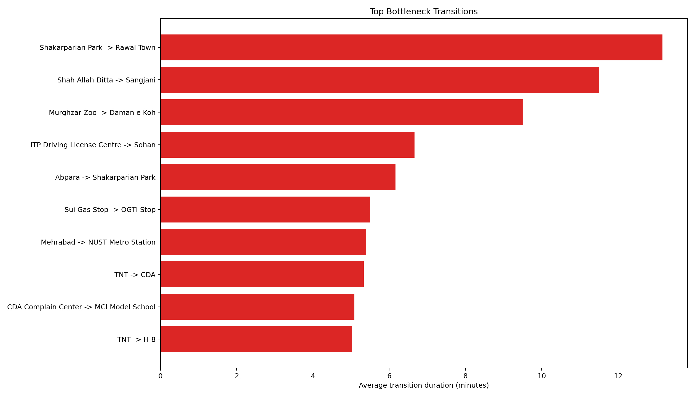
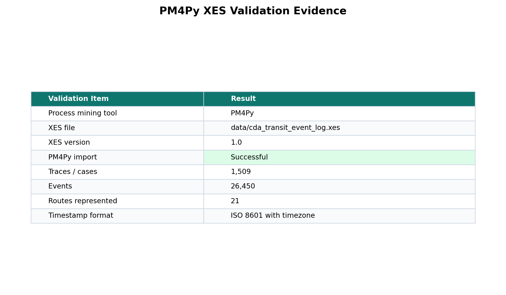
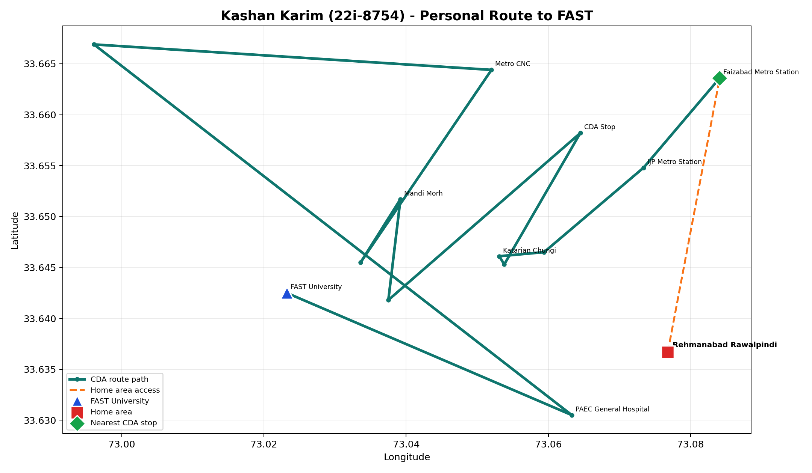

# CDA Transit Process Mining Platform

A Python and Streamlit analytics platform for CDA transit route intelligence. The project extracts CDA timetable data, builds a process-mining event log, validates PM4Py-compatible XES output, discovers stop-to-stop transitions, identifies bottlenecks, maps real route stops, and provides a deployed dashboard for exploring the results.

## Live App

https://cda-transit-process-mining-platform.onrender.com

## Features

- CDA route timetable extraction and normalization.
- Process-mining event log generation with route, trip, stop, timestamp, and case metadata.
- PM4Py-compatible XES export for external process-mining tools.
- Global and route-level process-map discovery.
- Transition frequency, trip-duration, and bottleneck analytics.
- Folium-based geospatial route visualization.
- Grounded route-planning helper based on extracted CDA stop and transition data.
- Validation checks for required CSV, JSON, and XES artifacts.
- Report-ready figures for process maps, bottlenecks, validation evidence, and personal route paths.

## Tech Stack

| Part | Tech |
| --- | --- |
| Language | Python |
| Dashboard | Streamlit |
| Data Processing | Pandas, NumPy |
| Process Mining | PM4Py, XES |
| Graph Analytics | NetworkX |
| Charts | Plotly, Matplotlib |
| Maps | Folium, Streamlit-Folium, Geopy |
| PDF / Report Assets | PyMuPDF, ReportLab, Kaleido |
| Deployment | Render |

## Screenshots

### Pipeline Run


### Streamlit Dashboard Overview


### Streamlit Process Maps


### Streamlit Real Map


### Streamlit Route Explorer


### Streamlit Bottleneck Analysis


### Streamlit Trip Planner


### Streamlit Personal Routes


### Generated Report Figures

### Global Process Map



### Route-Level Process Map



### Bottleneck Analysis



### PM4Py XES Validation



### Personal Route Intelligence



## Project Structure

```text
.
|-- code/                         # Pipeline, Streamlit app, validation, trip planner
|   |-- app.py                    # Streamlit dashboard
|   |-- run_pipeline.py           # End-to-end extraction and analytics pipeline
|   |-- extract_routes.py         # Route text extraction and normalization
|   |-- build_event_log.py        # Event log, XES, graph, and metrics generation
|   |-- trip_planner.py           # Grounded route-planning helper logic
|   `-- validate_outputs.py       # Output and XES validation checks
|-- data/                         # Organized extracted data and generated analytics
|   |-- 01_extracted/             # Route records, extraction audit, PDF coverage
|   |-- 02_event_logs/            # CSV event log and XES event log
|   |-- 03_analytics/             # Metrics, bottlenecks, transitions, graph JSON
|   |-- 04_map_data/              # Stop coordinates and map support files
|   `-- 05_validation/            # Validation summaries and XES evidence
|-- report/figures/               # Generated dashboard/report figures
|-- requirements.txt              # Python dependencies
|-- StartingCommands.md           # Quick command reference
`-- README.md
```

## Run Locally

Create and activate a virtual environment:

```powershell
python -m venv .venv
.\.venv\Scripts\Activate.ps1
python -m pip install --upgrade pip
python -m pip install -r requirements.txt
```

Rebuild analytics outputs:

```powershell
python code\run_pipeline.py
```

Start the dashboard:

```powershell
streamlit run code\app.py
```

Open:

```text
http://localhost:8501
```

## Deployment

The app is deployed on Render.

```text
https://cda-transit-process-mining-platform.onrender.com
```

```text
Build command: pip install -r requirements.txt
Start command: streamlit run code/app.py --server.port 10000 --server.address 0.0.0.0
```

## Dashboard Modules

| Module | Description |
| --- | --- |
| Overview | Route coverage, event rows, trip counts, and validation KPIs |
| Process Map | Global and route-level stop transition discovery |
| Geospatial View | CDA stop coordinates and map-based route exploration |
| Route Explorer | Route-specific stop sequences, timetable evidence, and transition tables |
| Bottlenecks | Slowest transitions and trip-duration performance analysis |
| XES Validation | PM4Py-readable event-log evidence and validation summary |
| Trip Planner | Grounded route recommendations using extracted CDA data |

## Analytics Snapshot

| Metric | Value |
| --- | ---: |
| CDA route PDFs processed | 21 |
| Extracted event rows | 26,450 |
| Unique trips / process cases | 1,509 |
| Route transition edges | 372 |
| XES version | 1.0 |
| Validation status | Passed |

## Data Outputs

| Output | Purpose |
| --- | --- |
| `data/01_extracted/routes.csv` | Normalized CDA route timetable records |
| `data/01_extracted/pdf_coverage_report.csv` | Source coverage and extraction pass evidence |
| `data/02_event_logs/event_log.csv` | Process-mining event log in CSV format |
| `data/02_event_logs/cda_transit_event_log.xes` | PM4Py-compatible XES event log |
| `data/03_analytics/transition_metrics.csv` | Stop transition frequency and duration metrics |
| `data/03_analytics/trip_metrics.csv` | Case-level trip timing and throughput metrics |
| `data/03_analytics/bottlenecks.csv` | Highest-latency route transitions |
| `data/03_analytics/process_graph.json` | Graph-ready process model data |
| `data/05_validation/validation_summary.json` | End-to-end output validation status |

## Validation

Run:

```powershell
python code\validate_outputs.py
```

Current validation summary:

```json
{
  "missing_files": [],
  "pdf_count": 21,
  "source_pdf_files_present": false,
  "coverage_all_pass": true,
  "route_count": 21,
  "event_rows": 26450,
  "trip_count": 1509,
  "transition_edge_count": 372,
  "xes_version": "1.0",
  "passed": true
}
```

The GitHub-ready dataset stores extracted route artifacts and coverage evidence. Raw source PDFs can be added locally and the same validator will count them directly.

## Scripts

Run the full pipeline:

```powershell
python code\run_pipeline.py
```

Validate outputs:

```powershell
python code\validate_outputs.py
```

Clean root-level generated files from `data/` after experimentation:

```powershell
python code\clean_data_root.py
```
